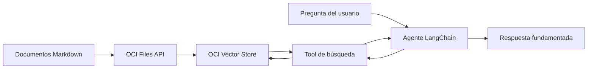

# Agente RAG con LangChain y OCI Vector Store

Este repositorio contiene un laboratorio práctico para construir un agente de generación aumentada por recuperación (**RAG**) con LangChain y OCI Generative AI.

El agente consulta documentos Markdown indexados en un OCI Vector Store mediante una tool de búsqueda. El diseño es flexible: permite cambiar documentos, vector stores, regiones y modelos utilizando variables de entorno, sin modificar la implementación principal.

Todo el código del laboratorio está contenido en [`notebook.ipynb`](notebook.ipynb). No se requieren scripts Python externos.

## Arquitectura



El flujo tiene dos etapas:

1. **Ingesta:** un documento se carga mediante OCI Files API y se agrega al vector store usando un file batch.
2. **Consulta:** el agente llama a una tool que busca fragmentos relevantes y utiliza ese contexto para responder.

## Estructura del proyecto

```text
.
├── data/
│   └── *.md
├── .env
├── .env.template
├── notebook.ipynb
└── README.md
```

- `data/`: documentos Markdown disponibles para el laboratorio.
- `notebook.ipynb`: laboratorio autocontenido con explicaciones en español y código Python en inglés.
- `.env.template`: plantilla con las variables requeridas.
- `.env`: configuración local de OCI. No debe incluirse en control de versiones.

## Requisitos

- Python 3.11 o superior.
- Un proyecto de OCI Generative AI.
- Un OCI Vector Store en la misma región que el proyecto.
- Un perfil de OCI con permisos para utilizar Generative AI.
- El entorno `micromamba` del proyecto.

Activa el entorno e instala las dependencias:

```bash
mm activate
python -m pip install "langchain>=1,<2" "langchain-openai>=1,<2" \
    openai oci-openai httpx python-dotenv
```

## Configuración

Copia la plantilla y completa el archivo `.env`:

```bash
cp .env.template .env
```

Configura los OCIDs requeridos:

```dotenv
OCI_COMPARTMENT_ID=ocid1.compartment.oc1..<your-compartment-ocid>
OCI_GENERATIVE_AI_PROJECT_ID=ocid1.generativeaiproject.oc1..<your-project-ocid>
```

También puedes definir estas variables opcionales:

```dotenv
OCI_REGION=us-ashburn-1
OCI_PROFILE=latinoamerica
OCI_MODEL_ID=openai.gpt-5
OCI_VECTOR_STORE_ID=<your-vector-store-id>
OCI_SOURCE_DOCUMENT=<your-document.md>
OCI_UPLOAD_DOCUMENT=false
```

| Variable | Descripción | Comportamiento predeterminado |
|---|---|---|
| `OCI_REGION` | Región de OCI | `us-ashburn-1` |
| `OCI_PROFILE` | Perfil del archivo de configuración de OCI | `latinoamerica` |
| `OCI_MODEL_ID` | Modelo utilizado por el agente | `openai.gpt-5` |
| `OCI_VECTOR_STORE_ID` | Vector store que se consultará | Vector store más reciente |
| `OCI_SOURCE_DOCUMENT` | Archivo dentro de `data/` | Primer `.md` disponible |
| `OCI_UPLOAD_DOCUMENT` | Activa la carga del documento | `false` |

El proyecto, el vector store y los endpoints deben pertenecer a la misma región.

## Selección flexible de documentos

El notebook descubre los documentos disponibles y selecciona uno mediante configuración:

```python
from pathlib import Path
import os

DATA_DIRECTORY = Path("data")
available_documents = sorted(DATA_DIRECTORY.glob("*.md"))

if not available_documents:
    raise FileNotFoundError(
        "No Markdown documents were found in the data directory."
    )

configured_document = os.getenv("OCI_SOURCE_DOCUMENT")
document_path = (
    DATA_DIRECTORY / configured_document
    if configured_document
    else available_documents[0]
)
```

Para añadir datos nuevos, copia otro archivo `.md` dentro de `data/` y actualiza `OCI_SOURCE_DOCUMENT`.

## Clientes de OCI

El laboratorio utiliza dos clientes porque OCI separa las operaciones de inferencia y control plane:

```python
from oci_openai import OciOpenAI, OciUserPrincipalAuth


def create_auth():
    return OciUserPrincipalAuth(profile_name=PROFILE)


client = OciOpenAI(
    auth=create_auth(),
    region=REGION,
    compartment_id=COMPARTMENT_ID,
    project=PROJECT_ID,
)

control_plane_client = OciOpenAI(
    auth=create_auth(),
    base_url=CONTROL_PLANE_URL,
    compartment_id=COMPARTMENT_ID,
    project=PROJECT_ID,
)
```

- `client`: carga de archivos, file batches, búsqueda e inferencia.
- `control_plane_client`: listado, creación y consulta de vector stores.

## Selección del vector store

Si no se proporciona un identificador, el laboratorio selecciona el vector store más reciente:

```python
vector_stores = control_plane_client.vector_stores.list(
    limit=20,
    order="desc",
)

if not vector_stores.data:
    raise RuntimeError(
        "No vector stores are available in the configured compartment."
    )

configured_vector_store_id = os.getenv("OCI_VECTOR_STORE_ID")
VECTOR_STORE_ID = configured_vector_store_id or vector_stores.data[0].id
```

En entornos compartidos o con varios recursos, se recomienda definir explícitamente `OCI_VECTOR_STORE_ID`.

## Carga e indexación de un documento

La carga está desactivada de forma predeterminada para evitar duplicar documentos al ejecutar el notebook varias veces. Para activarla:

```dotenv
OCI_UPLOAD_DOCUMENT=true
```

El archivo se crea mediante Files API y después se agrega al vector store:

```python
with document_path.open("rb") as file_content:
    uploaded_file = client.files.create(
        file=file_content,
        purpose="user_data",
    )

batch = client.vector_stores.file_batches.create(
    vector_store_id=VECTOR_STORE_ID,
    file_ids=[uploaded_file.id],
    attributes={
        "source": document_path.name,
        "format": "markdown",
    },
)
```

La indexación es asíncrona. El notebook consulta el estado hasta obtener `completed`, `failed` o `cancelled`:

```python
import time

while True:
    batch_status = client.vector_stores.file_batches.retrieve(
        vector_store_id=VECTOR_STORE_ID,
        batch_id=batch.id,
    )
    if batch_status.status in {"completed", "failed", "cancelled"}:
        break
    time.sleep(2)
```

## Búsqueda en el vector store

La búsqueda directa ayuda a validar la recuperación antes de construir el agente:

```python
search_results = client.vector_stores.search(
    vector_store_id=VECTOR_STORE_ID,
    query="¿Cuáles son los temas y condiciones más importantes del documento?",
    max_num_results=3,
    rewrite_query=False,
)
```

`rewrite_query` debe permanecer en `False` porque el endpoint utilizado no soporta esta opción.

## Tool de LangChain

La tool encapsula la búsqueda y elimina fragmentos duplicados antes de entregar el contexto al modelo:

```python
from langchain.tools import tool


@tool
def search_knowledge_base(query: str) -> str:
    """Search the configured knowledge base for relevant information."""
    results = client.vector_stores.search(
        vector_store_id=VECTOR_STORE_ID,
        query=query,
        max_num_results=10,
        rewrite_query=False,
    )

    chunks = []
    seen_texts = set()

    for result in results.data:
        for content in result.content:
            text = content.text.strip()
            if not text or text in seen_texts:
                continue

            seen_texts.add(text)
            chunks.append(
                "\n".join(
                    [
                        f"Source: {result.filename}",
                        f"Relevance: {result.score:.3f}",
                        text,
                    ]
                )
            )

    if not chunks:
        return "No results were found in the knowledge base."

    return "\n\n---\n\n".join(chunks)
```

Solicitar diez resultados antes de deduplicarlos ayuda cuando un vector store contiene versiones repetidas de un documento.

## Modelo y agente

`ChatOpenAI` se conecta al endpoint compatible con OpenAI de OCI utilizando un cliente HTTP firmado:

```python
from langchain_openai import ChatOpenAI

model = ChatOpenAI(
    model=MODEL_ID,
    api_key="not-used",
    base_url=BASE_URL,
    default_headers={
        "OpenAI-Project": PROJECT_ID,
        "opc-compartment-id": COMPARTMENT_ID,
    },
    http_client=httpx.Client(auth=create_auth()),
    store=False,
    max_retries=2,
)
```

El agente recibe el modelo, la tool y las instrucciones generales:

```python
from langchain.agents import create_agent

agent = create_agent(
    model=model,
    tools=[search_knowledge_base],
    system_prompt=(
        "You are a knowledge-base assistant. Reply in the same language as "
        "the user. Always call the search_knowledge_base tool before answering "
        "questions about the available documents. Base your answer only on the "
        "retrieved results and clearly say when the knowledge base does not "
        "contain enough information."
    ),
)
```

## Consultar el agente

La función auxiliar mantiene sencilla la interfaz del laboratorio:

```python
def ask(question: str) -> str:
    """Run the agent and return its final text response."""
    result = agent.invoke(
        {"messages": [{"role": "user", "content": question}]}
    )
    return result["messages"][-1].content


response = ask(
    "¿Cuáles son los requisitos, costos y condiciones más importantes?"
)
print(response)
```

Los nombres, comentarios, docstrings e instrucciones internas del código están en inglés. Las preguntas se realizan en español para demostrar que el agente conserva el idioma del usuario.

## Ejecutar el laboratorio

1. Activa el entorno con `mm activate`.
2. Completa `.env`.
3. Agrega uno o más archivos `.md` a `data/`.
4. Abre `notebook.ipynb`.
5. Selecciona el kernel del entorno `venv`.
6. Ejecuta las celdas en orden.
7. Activa la carga únicamente cuando necesites indexar un documento nuevo.

## Solución de problemas

### `OpenAi-Project header must be provided`

Verifica que `OCI_GENERATIVE_AI_PROJECT_ID` esté definido y que el cliente incluya `project=PROJECT_ID` o el encabezado `OpenAI-Project`.

### `NotAuthorizedOrNotFound`

Comprueba que:

- El proyecto y el vector store pertenezcan a la región configurada.
- El perfil de OCI tenga acceso al compartment.
- El identificador del vector store sea correcto.
- Se utilice el cliente de control plane para administrar vector stores.

### `rewrite_query is not supported`

Configura siempre:

```python
rewrite_query=False
```

### Se obtienen resultados duplicados

Evita volver a ejecutar la carga con `OCI_UPLOAD_DOCUMENT=true` para un archivo ya indexado. La tool deduplica fragmentos idénticos, pero es preferible mantener limpio el vector store.

## Notas de seguridad

- No guardes credenciales ni OCIDs sensibles directamente en el notebook.
- No publiques el archivo `.env`.
- Utiliza políticas IAM con los permisos mínimos necesarios.
- No cargues información personal o regulada en un laboratorio de demostración.
